# SCSDB.

A modern React-based movie database UI (SCSDB) with trending movies, search, trailers, and a dark purple theme inspired by TMDB. Built using React, Redux, React Router, and TMDB API.

📌 Overview

SCSDB is a complete movie discovery platform built using React, Redux Toolkit, Tailwind CSS, and the TMDB API.
It features dynamic content fetching, responsive layouts, animated transitions, and an immersive UI similar to top streaming platforms.

📸 Screenshots

All screenshots are located in: public/screenshots/

## 🏠 Home Page
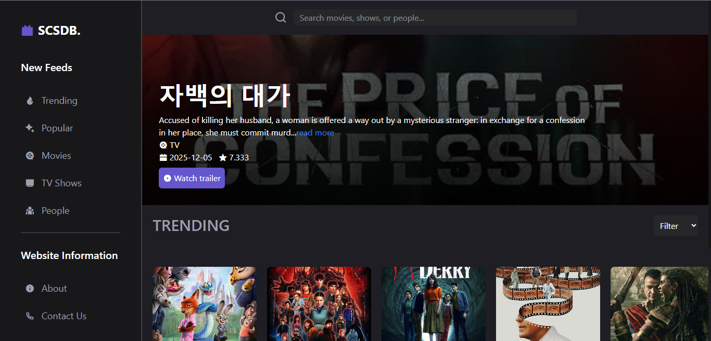

## 🔥 Trending
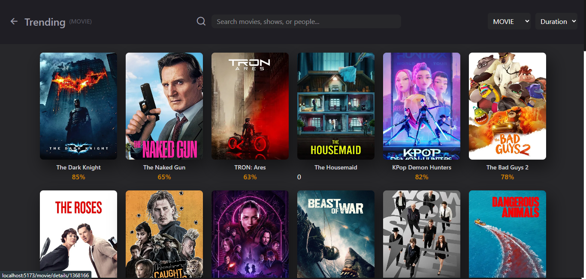

## 📈 Popular
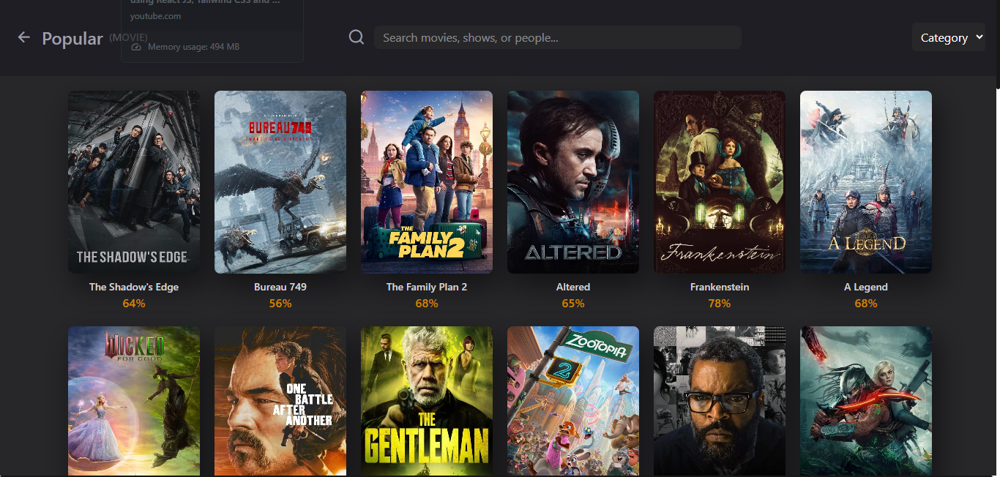

## 🎬 Movies Page
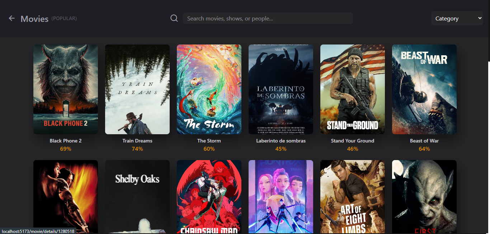

## 📺 TV Shows Page
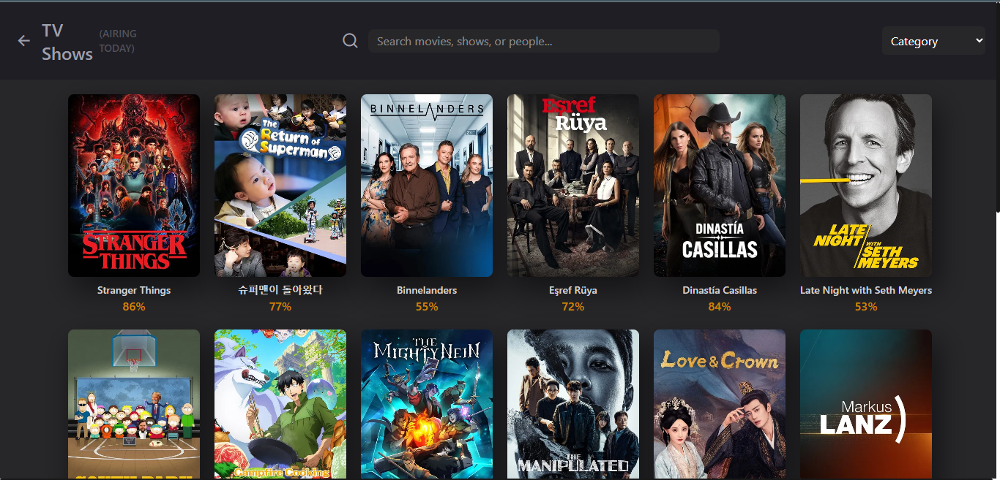

## 👤 People Page
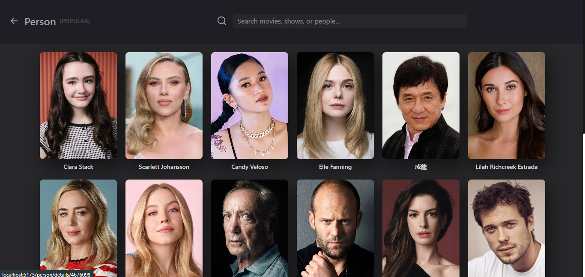

## 🎞 Movie / TV Details
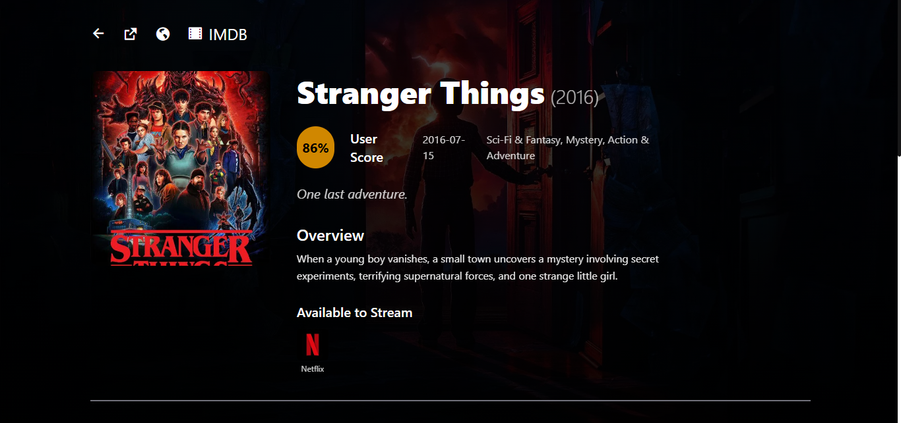

## 📄 Overview Section
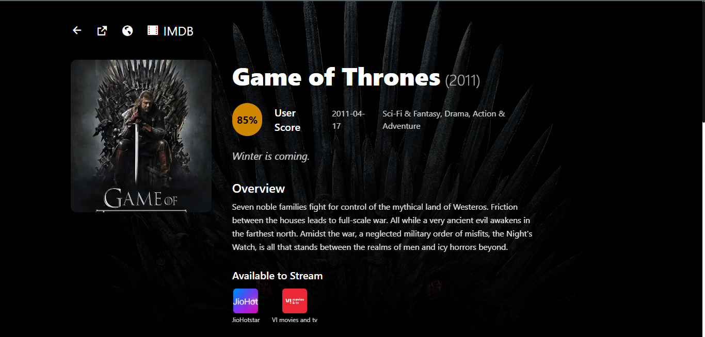

## 📚 Seasons (TV Shows)
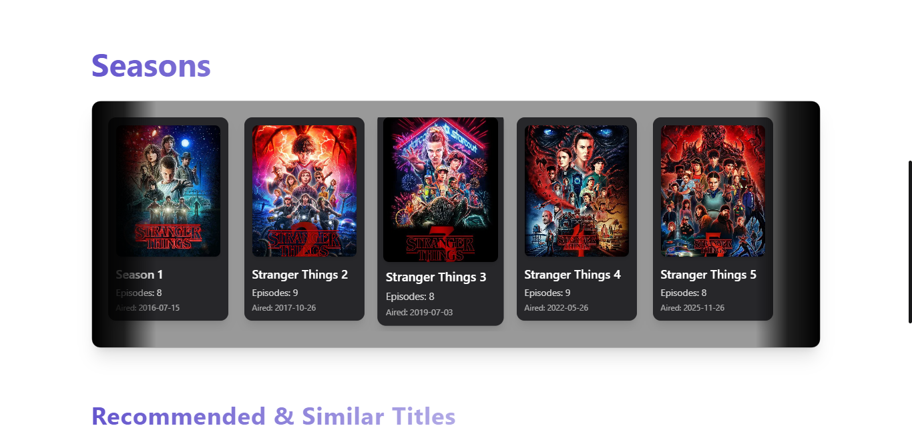

## 🎥 Similar Titles
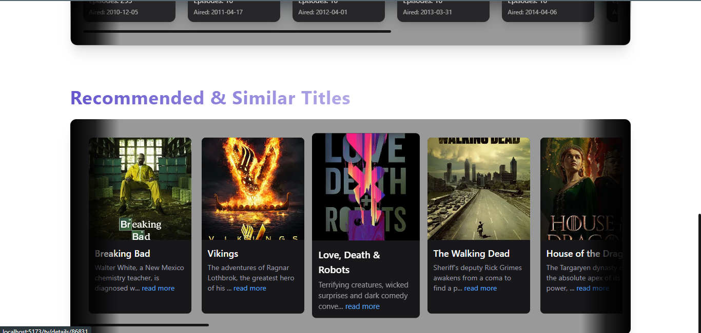

## ▶️ Trailer Modal
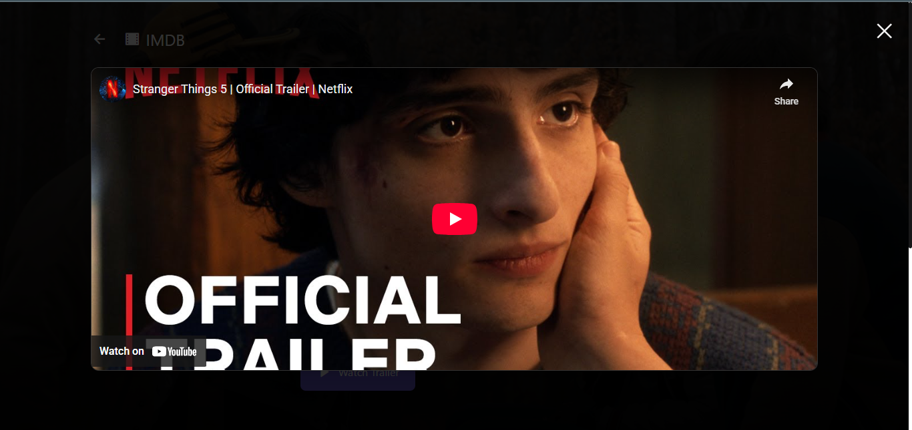

## 🔍 Search Bar

✨ Features
🎨 UI & Experience

Clean, modern dark + purple themed UI

Inspired by TMDB design structure

Smooth animations with Framer Motion

Beautiful skeleton loaders & lazy loading

🎬 Movies & TV

Browse Trending Movies / TV Shows

Browse Popular Movies / Popular TV Shows

Dedicated pages:

Movies

TV Shows

People

Detailed movie pages:

Overview

Cast & Crew

Ratings, Genres

Watch Providers

Seasons (TV shows)

Similar Titles

🔍 Search System

Global search for:

Movies

Shows

People

Fast API-based live search results

▶️ Trailer Feature

Watch trailers in-app via YouTube modal

Smooth open/close animation

Supports React Player or iframe

⚡ Performance

Optimized API calls

Redux Toolkit for global state

Lazy loading images

Fast page routing with React Router

🧰 Tech Stack
Frontend

React (Vite recommended)

Redux Toolkit

React Router DOM

Tailwind CSS

Framer Motion

Axios / Fetch

React Icons

Backend / API

TMDB API (The Movie Database)

📂 Folder Structure
scsdb-movie-app/
├─ public/
│  ├─ index.html
│  └─ screenshots/
│      ├── home.png
│      ├── trending.png
│      ├── popular.png
│      ├── movies.png
│      ├── tvshows.png
│      ├── people.png
│      ├── detail.png
│      ├── overview.png
│      ├── seasons.png
│      ├── similar.png
│      ├── trailer.png
│      └── searchbar.png
├─ src/
│  ├─ api/tmdb.js
│  ├─ assets/
│  ├─ components/
│  │  ├─ Header/
│  │  ├─ Sidebar/
│  │  ├─ MovieCard/
│  │  ├─ HorizontalCards/
│  │  └─ Loading/
│  ├─ pages/
│  │  ├─ Home/
│  │  ├─ Movies/
│  │  ├─ TvShows/
│  │  ├─ People/
│  │  └─ MovieDetails/
│  ├─ store/           
│  ├─ hooks/
│  ├─ utils/
│  ├─ styles/
│  ├─ App.jsx
│  ├─ index.jsx
│  └─ routes.jsx
├─ .env.example
├─ package.json
└─ README.md

🚀 Getting Started
📌 Prerequisites

Node.js 16+

npm / yarn

TMDB API Key

📥 Installation
git clone https://github.com/<your-username>/scsdb-movie-app.git
cd scsdb-movie-app
npm install

▶️ Start Development Server
npm run dev

🔑 Environment Variables

Create a .env file:

VITE_TMDB_API_KEY=your_api_key_here

🏷 GitHub Topics
react
movie-app
tmdb
frontend
javascript
reactjs
redux
vite
tailwindcss
movie-database
ui-design
scsdb

🎉 Final Notes

This project is built for:

Learning modern React

Practicing API integration

Building a production-style movie UI

Showcasing frontend skills
